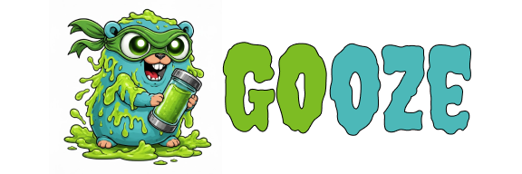

A Golang mutation testing tool inspired by TMNT "ooze" mutagen.

## Complete Go Mutation Testing Categories

- [ ] Boolean Literal
- [ ] Numbers
- [ ] Unary / Negation
- [ ] Arithmetic
- [ ] Core Logic & Arithmetic
- [ ] Statement
- [ ] Statement Deletion
- [ ] Return Value
- [ ] Branch
- [ ] Conditional
- [ ] Loop
- [ ] Control Flow & Loops
- [ ] Expression
- [ ] Complex Expression
- [ ] Slice
- [ ] Map
- [ ] Pointer & Memory
- [ ] Interface / Type Assertion
- [ ] Function Signature / Parameter
- [ ] Type System & Interfaces
- [ ] Global State & Initialization
- [ ] Go-Specific Error Handling
- [ ] Concurrency & Channels
